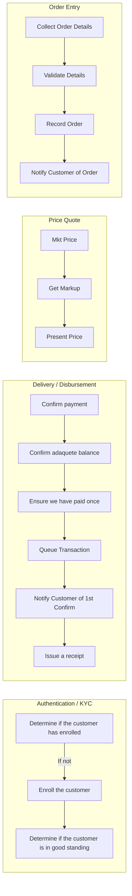

# Athena Persistent State Machines

## Why?

The purpose of this library is to encapsulate code is reused whenever we sell crypto currency & perform other tasks.  Hopefully we'll achieve some economies of scale with all of the different methods Athena has to sell crypto currency.  As of the initial writing of this project we have multiple avenues to vend crypto currency (ATM Machines, BitQuick.co, AIS / OTC, Rappi, QPagos).

In all of the sales channels, we conduct similar steps but have slightly different procedures.  In all cases we'll determine a market price, quote a price at which our customer can buy/sell, perform some KYC routines, confirm they've paid, make sure they've accepted the terms of our sales agreement, disburse the crypto currency, send a receipt.  This project seeks to provide a uniform method for conducting those functions.

### Dependencies

This library is based on the [pytransitions](https://github.com/pytransitions/transitions) project.  The project is well established & thoroughly tested.

## General Flow

The following states



## Examples

Some examples of how to use the library are below

### Withdrawing crypto currency

```python
from apsm.disburse import CryptoDisburseRequest

dr = CryptoDisburseRequest(
            initial='submitted',#Initial state
            requested_by='test_user',
            requesting_app='test_program',
            purpose='test',
            amount=Decimal('0.0001'),
            crypto_currency='BTC',
            crypto_address='1HB5XMLmzFVj8ALj6mfBsbifRoD4miY36v'
        )
if dr.is_approved():
	# Send it
	dr.send_to_node()
	assert(dr.state == 'sent')
```

## Testing


## Installation & Integration

This project is intended to be used as a project for libraries on which it depends.  You can include this project as a subtree.  Using commands like the following:


```console
git subtree add --prefix src/apsm https://git-codecommit.us-west-2.amazonaws.com/v1/repos/athena-persistent-state-machines master --squash
```
_To add into your project_

```console
git subtree pull -P src/apsm --squash  https://git-codecommit.us-west-2.amazonaws.com/v1/repos/athena-persistent-state-machines master
```
_To pull in newest changes from the **master** branch_

Other useful resources:
 - [git subtrees: a tutorial](https://medium.com/@v/git-subtrees-a-tutorial-6ff568381844)

